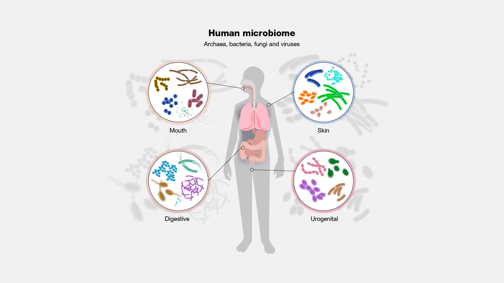
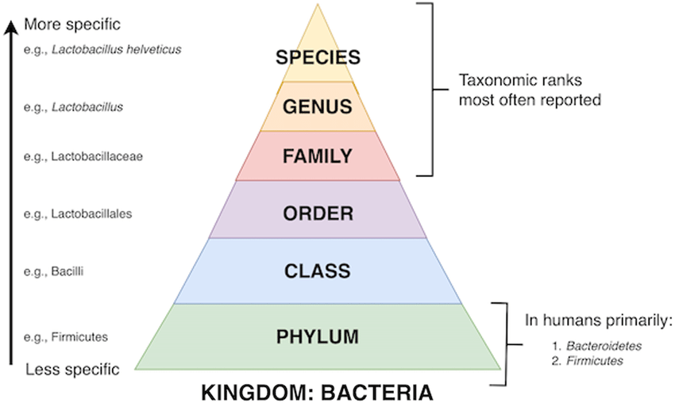
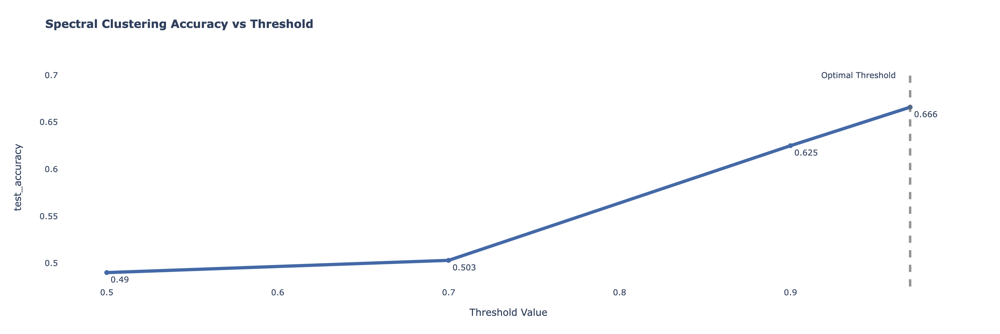
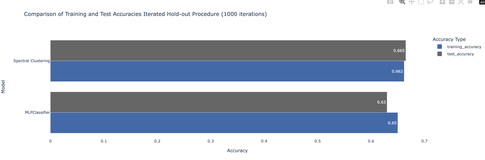
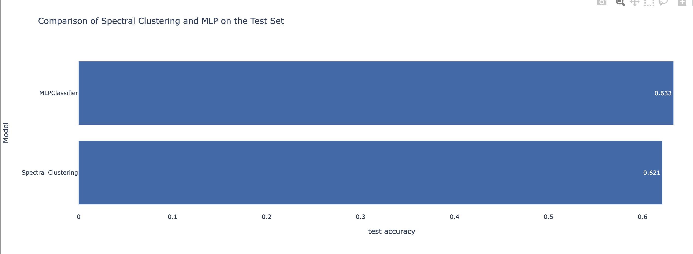

# Applying Spectral Clustering to Gut Microbiome Data: A Classification Approach

## Introduction
brief introduction of the project and what's its aim

## Microbiome Data 
### Introduction
The human microbiome is the collection of microorganisms, that reside on or within human tissues and biofluids along with the corresponding anatomical sites.

Microbiome can be analyzed at many levels,
the higher the level the more specific the
classification of the microorganisms.

### Curated Metagenomic Data of the Human Microbiome
#### Overview of the curatedMetagenomicData package

The `curatedMetagenomicData` package offers standardized and curated human microbiome data for conducting novel analyses. It encompasses various datasets including gene families, marker abundance, marker presence, pathway abundance, pathway coverage, and relative abundance. The data originates from samples collected across different body sites. Taxonomic abundances for bacteria, fungi, and archaea are calculated using MetaPhlAn3, while metabolic functional potential is computed using HUMAnN3. The package provides both manually curated sample metadata and standardized metagenomic data, which are available as (Tree)SummarizedExperiment objects.

**Authors and Contributors:**
- **Authors:** Lucas Schiffer, Levi Waldron
- **Contributors:** Edoardo Pasolli, Jennifer Wokaty, Sean Davis, Audrey Renson, Chloe Mirzayi, Paolo Manghi, Samuel Gamboa-Tuz, Marcel Ramos, Valerie Obenchain, Kelly Eckenrode, Nicola Segata

[Package Link](https://bioconductor.org/packages/release/data/experiment/html/curatedMetagenomicData.html)

#### Gut Microbiome Data For IBD (Inflamatory Bowel Disease) and CRC (Colorectal Cancer) Patients
The CuratedMetagenomicData package offers datasets from two distinct cohorts: one comprising healthy individuals and the other consisting of subjects with various health conditions. Among the diseased subjects, categories include type 2 diabetes, colorectal cancer, adenoma, impaired glucose tolerance, atherosclerotic cardiovascular disease, and inflammatory bowel disease. For this specific project, individuals with inflammatory bowel disease (IBD) and colorectal cancer (CRC) were selected as subjects of interest. Furthermore, the analysis was conducted by selecting the family level. 

## The Classification Approach

### Dataset
The dataset consists of 555 samples for both the inflammatory bowel disease (IBD) and colorectal cancer (CRC) classes. Each sample is characterized by 99 columns, representing various microbial families and their relative abundances. These relative abundance values indicate the prevalence of specific microbial families within each sample's gut microbiome. For further details, refer to the 'microbiome_family_level.csv' file located in the data folder.
### Splitting the Dataset
The dataset has been splitted using 67% for the training set and 33% for the validation.
### Iterated Hold-Out Procedure (Model Selection)
In order to select the best threshold for the computation of the affinity matrix and the best parameters for the MLPClassifier an iterated hold-out procedure was performed splitting the training set as follows: 67% training set and 33% test set. The iteration was set to 1000. 
### Spectral Clustering as a Classifier
By adapting the unsupervised procedure of the spectral clustering, a classification approach was created using different thresholds to compute the affinity matrix fed to the algorithm. 
In order to adapt a unsupervised approach to be supervised, I decided to run the spectral clustering as it follows:
1. The affinity matrix was computed using braycurtis distance
2. The matrix that represents a graph has been thresholded trying different values and choosing the value that optimizes the accuracy score 
3. Once the clusters were learned, a class was assigned to each of them by computing the majority class in each cluster
4. The model represented by two cluster was tested by transforming the new sample in order to be compatible with the affinity matrix computed in the model 
5. The transformed sample was assigned to the closest cluster.
### Optimization of the Spectral Clustering by Thresholding the Affinity Matrix
For the optimization of the Spectral Clustering procedure, many thresholds were used. Below is a chart showing the accuracy values for different thresholds (for each threshold an iterated hold-out procedure with 1000 iterations was ran).

### Optimization of the MLPClassifier
The MLPClassifier was optimized using the following parameters:
hidden layers, alpha, max iterations
In this case the parameters were optimized one by one by running an iterated hold-out with 1000 iterations having as a results the following best parameters:

- hidden layers: (99,50)
- alpha:1e-5
- max_iter:3

relu activation function and adam solver were used.

### Comparing MLP Classifier and Spectral Clustering Accuracy
The image below shows a comparison of the two best models with optimal parameters. The performances on the training and the test set are quite similar for both models telling that even with a lot of variables overfitting was handled. Furthermore, the two models perform almost the same for this problem istance. 

The optimal models were trained using the whole training set and validate on 33% of the initial split. The image below shows the performance of the two models on the validation set. 

## Conclusion
The two models showed to perform quite the same on this problem istance, indeed the two performances were quite similar. Eventhough the models got better results than a random guess, the performances are not quite remarkable this might be caused by the high numerosity of the variable and the fact that the number of samples wasn't enough. Sparsity may have played a crucial role too. Overall, considering the adaptation of an unsupervised algortithm and the limited amount of data the Spectral clustering classifier performed quite well. 
What's the conclusion?